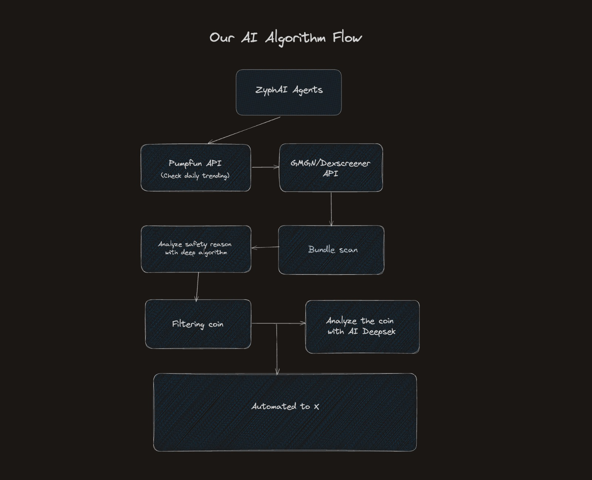

# Zyph AI - Solana Coin Tracking & Analysis AI Agent

## Overview

Zyph AI is an advanced AI-powered agent for tracking and analyzing Pump.fun coins on the Solana blockchain. It automatically processes market data, generates insights, and posts them to X (Twitter). Built with **pnpm** and optimized for speed, Zyph AI is designed for seamless real-time operations.

---

## Algorithm Chart



## Installation

Ensure you have **pnpm** installed. If not, install it using:

```bash
npm install -g pnpm
```

Clone the repository and install dependencies:

```bash
git clone our-repo-url.git
cd zyph-ai
pnpm install
```

---

## Running the AI Agent

To start the agent:

```bash
pnpm run:agent or npx tsx autonomus-agent.ts
```

### How It Works

1. Fetches real-time **Pump.fun** coin data from the **Solana blockchain**.
2. Analyzes trends using AI models via **DeepSeek**, **Perplexity**, or **DeepInfra**.
3. Stores and processes data with **BitQuery**, **Moralis**, and **Upstash Redis**.
4. Automatically posts insights to **X (Twitter)**.

---

## Configuration

Set up the required environment variables in a `.env` file:

```ini
DEEPSEEK_APIKEY=""
PERPLEXITY_APIKEY=""
DEEPINFRA_APIKEY=""
MORALIS_APIKEY=""
BITQUERY_API_KEY=""

UPSTASH_REDIS_URL=""
UPSTASH_REDIS_TOKEN=""

TWITTER_USERNAME=""
TWITTER_PASSWORD=""
TWITTER_ACCESS_SECRET=""
TWITTER_ACCESS_TOKEN=""
TWITTER_API_KEY=""
TWITTER_API_SECRET=""
TWITTER_APP_ID=""
TWITTER_BEARER_TOKEN=""
```

Ensure all API keys are set correctly.

---

## Automating Twitter Posts

Zyph AI automatically posts insights to **X (Twitter)**, including:

- Top trending **Pump.fun** coins.
- Market sentiment analysis.
- Notable price movements.
- AI-generated trading signals.

You can adjust **posting frequency** and **message format** in `config.ts`.

---

## Deployment

### Using PM2 (Recommended)

For persistent execution:

```bash
pnpm dlx pm2 start autonomus-agent.ts --name zyph-ai
```

### Using Docker

1. Create a `Dockerfile`:

   ```dockerfile
   FROM node:20
   WORKDIR /app
   COPY . .
   RUN npm install -g pnpm && pnpm install
   CMD ["pnpm", "run:agent"]
   ```

2. Build and run the container:

   ```bash
   docker build -t zyph-ai .
   docker run -d --env-file .env --name zyph-ai zyph-ai
   ```

---

## Roadmap

- Implement historical data tracking for better AI predictions.
- Create terminal ai agents for analyze any tokens.
- Creating notification alert with telegram.

---

## Contributing

Feel free to submit issues or pull requests to enhance Zyph AI.

---

## License

MIT License © 2025 Zyph AI
